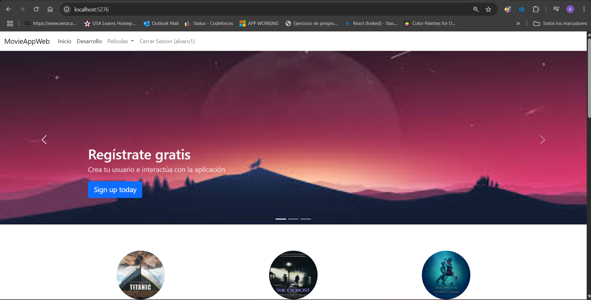
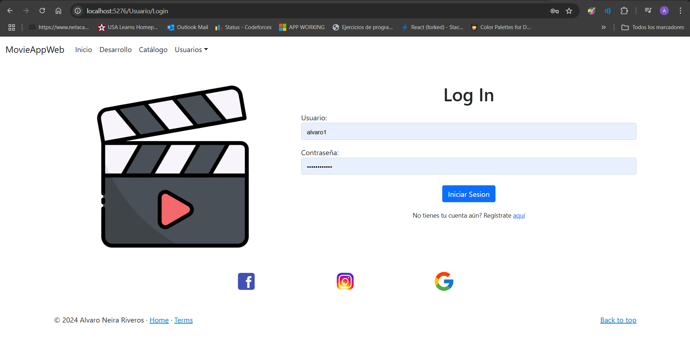
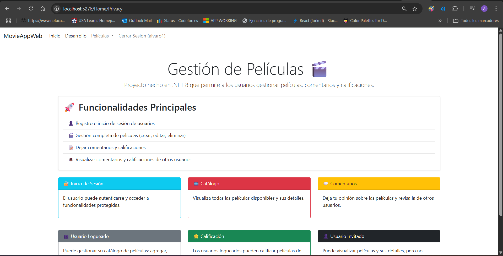
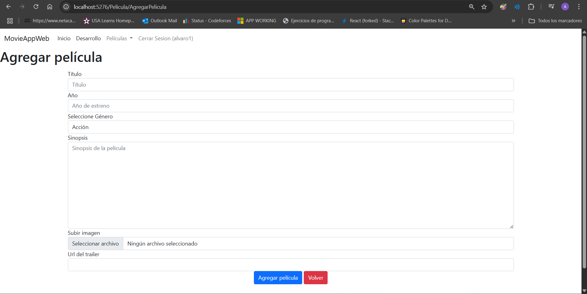
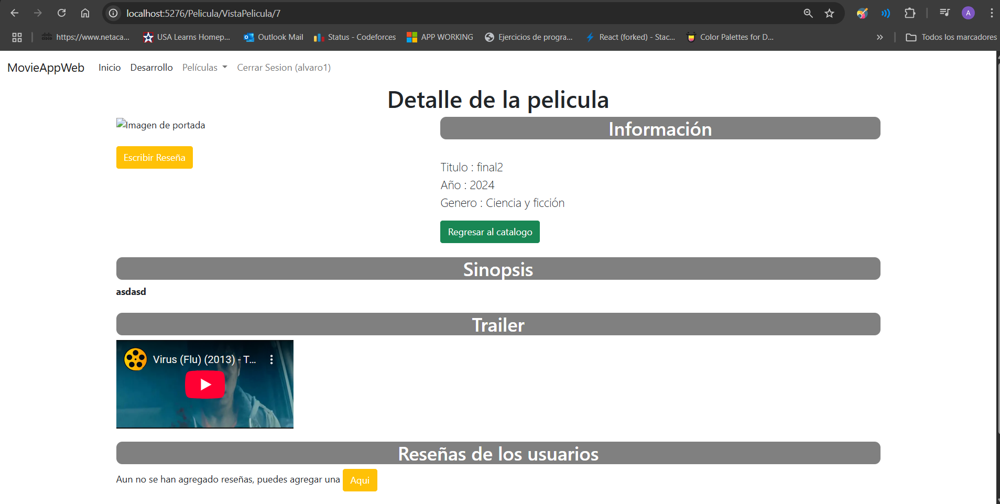
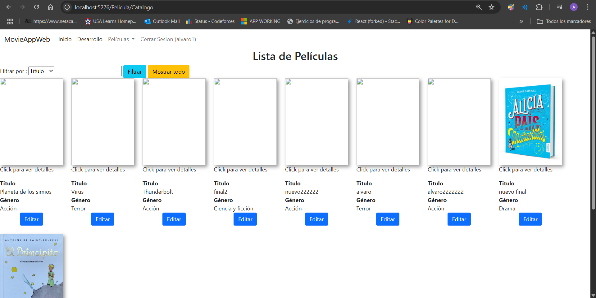
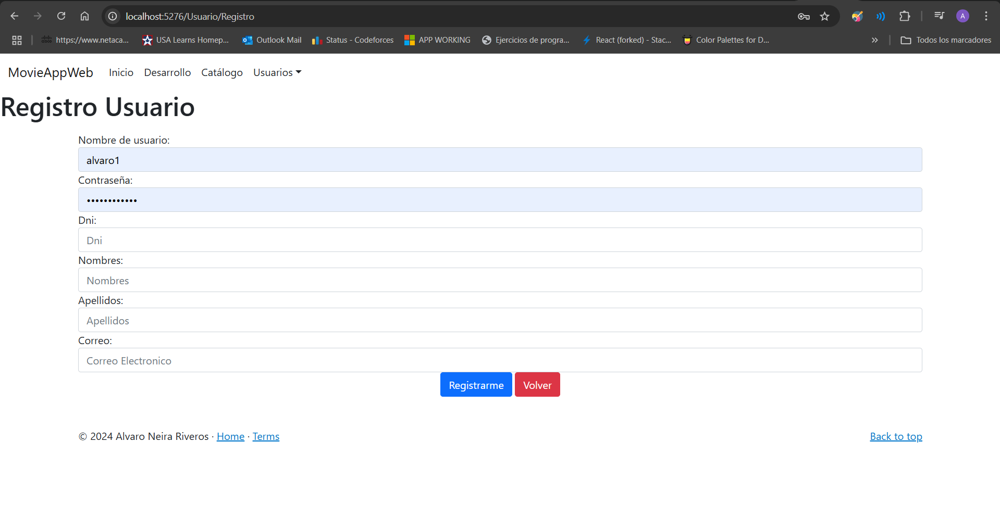

#  🚀 Proyecto - Gestión de películas MovieApp
- En este proyecto desarrollé una página web responsive para la gestiòn de películas 
---

#	🎯 Objetivo
- Registrar peliculas y usuarios ( CRUD )
- Login de usuario
- Vista de usuario logueado y no logueado
- Agregar comentarios y calificación
- Visualización de la valoración de películas de los usuarios
  
---

#	💻 Tecnologías y comentarios
- Migración a .NET 8 (Fue realizado anteriormente con .net core 3.1)
- Se mejoraron y agregaron funcionalidades que antes no funcionaban
- Corrección al agregar imágenes a la bd
- Diseños Responsives
- Entity Framework
- SQL Server

#	🎥 Diseños y capturas de pantalla
- Home

- Login

- Detalle del proyecto

- Agregar pelicula

- Detalle de pelicula

- Listado de peliculas

- Registro de usuario

